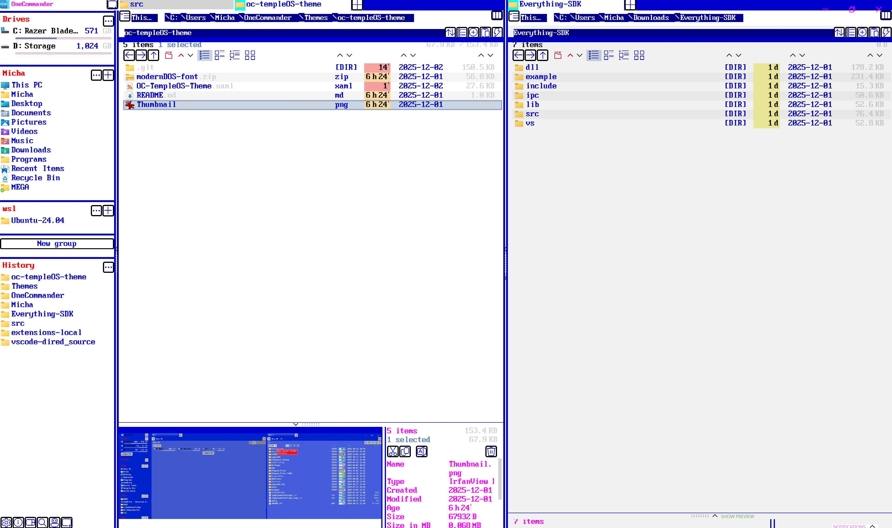

# TempleOS-Light-Theme for OneCommander

A retro TempleOS inspired theme for OneCommander.

Quick Install

- Copy the `OC-TempleOS-Light-Theme.xaml` folder to OneCommander `Themes` directory (if not already there).
- In OneCommander press `Ctrl+Shift+Alt+F5` to reload themes.

Customization

- Edit `OC-TempleOS-Light-Theme.xaml` to tweak colors: `MainBackgroundBrush`, `DialogBackgroundBrush`, `TextPrimaryBrush`, `ButtonBackgroundBrush`, etc.
- Use any editor that preserves UTF-8 and line endings; Ctrl+Shift+Alt+F5 will reload most changes without restarting OneCommander.

Included font

- This folder includes `modernDOS-font.zip` containing the Modern DOS/Console fonts used in screenshots.